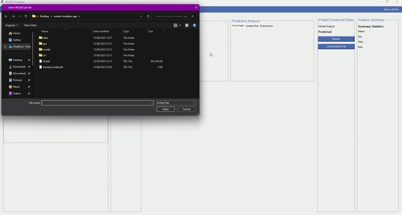

# WESAD Visualizer App

A Python-based interactive GUI application for exploring physiological sensor data and classifying emotional states using Machine Learning.


## 📚 Dataset: WESAD (Wearable Stress and Affect Detection)

This project uses the [WESAD dataset](https://ubi29.informatik.uni-siegen.de/usi/data_wesad.html), a multimodal dataset designed for stress and affect recognition using wearable physiological signals.

- Collected from 15 participants using **chest-worn** and **wrist-worn** devices.
- Includes physiological data such as **EDA, EMG, RESP, Temperature, ECG**, etc.
- Each record contains time-synchronized sensor data labeled with emotional states: **Rest, Amusement, Stress**.
- Dataset is provided in `.pkl` format.

> 📖 Citation:  
Philip Schmidt, Attila Reiss, Robert Duerichen, Claus Marberger and Kristof Van Laerhoven,  
"Introducing WESAD, a multimodal dataset for Wearable Stress and Affect Detection",  
ICMI 2018, Boulder, USA, 2018.  
[Read the paper](https://www.eti.uni-siegen.de/ubicomp/papers/ubi_icmi2018.pdf)


---

## 🔍 What It Does

- Loads physiological sensor data from the [WESAD dataset](https://archive.ics.uci.edu/ml/datasets/Wearable+Stress+and+Affect+Detection)
- Performs feature extraction on signals such as EDA, EMG, RESP, and Temperature
- Trains a Decision Tree model to classify emotional states (Rest, Amusement, Stress)
- Presents key plots and ML predictions inside a user-friendly Tkinter GUI

---
## 🧵 What I Practiced & Built in This Project
From raw sensor data to predictions: I worked with .pkl files from the WESAD dataset and turned raw physiological signals (like EDA, EMG, TEMP, and RESP) into a format suitable for machine learning. 

Feature extraction made simple: I applied basic statistical operations (mean, std, etc.) to slices of time-series data, creating feature vectors for classification tasks.

Basic machine learning integration: I trained a DecisionTreeClassifier model with scikit-learn, saved it with pickle, and used it to classify emotional states inside the app.

A GUI that actually works: Built an interactive interface using Tkinter where users can load data, see plots, and get predictions — all in one place.

Modular code structure: Kept everything clean and organized by splitting the code into folders like src/, gui/, model/, and data/.

Running it is easy: The project includes a requirements.txt and handles model loading automatically — just drop a WESAD file into the right folder and you're good to go.

---


## 📁 Folder Structure

```
wesad-visualizer-app/
│
├── gui/
│   └── main_gui.py
├── src/
│   ├── main.py
│   ├── preprocessing.py
│   ├── predict.py
│   └── plot.py
├── model/                  
├── data/                   
│   └── (not included in repo)
├── requirements.txt
└── README.md
```

---

## ⚙️ How to Run

1. Download a `.pkl` file (e.g., `S2.pkl`) from the [WESAD Dataset](https://archive.ics.uci.edu/ml/datasets/Wearable+Stress+and+Affect+Detection)
2. Place it in the `data/` folder
3. Install the requirements:

```bash
pip install -r requirements.txt
```

4. Run the GUI:

```bash
python main.py
```

---

## ⚠️ Notes

- This project was designed for academic purposes. I aimed for demonstrates a basic level end to end project.
- GUI layout may not be fully responsive (first complete GUI attempt :)).
- Model performance is not the focus — the goal is demonstrating the full ML workflow.

---

